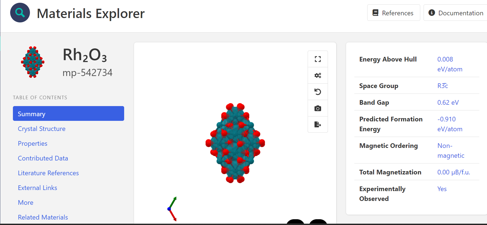
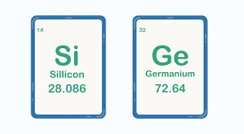
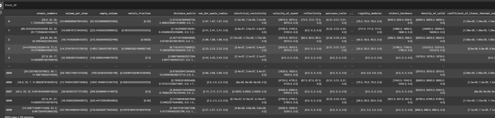

# Machine Learning in Semiconductor Materials.

Machine learning (ML) is increasingly being applied in semiconductor materials research to accelerate the discovery, design, and optimization of materials used in electronic devices. Traditionally, semiconductor materials have been studied through experimental methods and theoretical simulations, which can be time-consuming and resource-intensive. ML offers a powerful alternative by enabling predictions of material properties, discovery of new materials, and optimization of manufacturing processes.

### Applications of ML in Semiconductor Materials:

- **Material Property Prediction** : ML models can predict key properties like bandgap, carrier mobility, and thermal conductivity based on the material’s composition and structure. This allows researchers to screen a large number of materials quickly without extensive experiments.

- **Discovery of New Materials**: By analyzing existing datasets, ML algorithms can identify patterns and suggest new semiconductor materials that might have desirable properties, such as higher efficiency or better thermal stability.

- **Process Optimization**: In semiconductor manufacturing, ML is used to optimize processes like deposition, doping, and lithography. ML models can analyze data from manufacturing lines to improve yield, reduce defects, and enhance the overall efficiency of the production process.

- **Defect Detection**: ML algorithms can be employed in real-time defect detection in semiconductor wafers during the manufacturing process, reducing wastage and ensuring higher quality products.

# Why Semiconductors?

Semiconductors are materials that have electrical conductivity between that of a conductor (like copper) and an insulator (like glass). They are the foundation of modern electronics, used in devices like transistors, diodes, and integrated circuits.

Integration of ML into semiconductor research and production represents a significant advancement. By leveraging ML algorithms, the semiconductor industry can reduce development time, improve material performance, and streamline manufacturing processes, ultimately leading to more efficient and cost-effective electronic devices.

# What we Aim to Acheive in this project.

Our Main Objective in this project is to Design a machine learning algorithm that can adequately predict a key property of a material (such as bandgap, carrier mobility, and thermal conductivity ) based on the material’s composition and structure. With main focus on following steps:

- Identifying the main features that can completely describe the element/s.
- Building the dataset based on descriptors.
- Identifying the Model that would accurately predict the dependent variables.
- Rescaling the main features to highlight features with utmost importance.

We present an approach to help scale down the sizes of descriptors to give a better optimization.

### 1. Identifying the main features that can completely describe the element/s.

A major challange and objectives in material science is to generate machine learning (ML) models that can accurately, and rapidly predict a property for a given material by using information derived from the material's structure. However, when the right decriptors are available, predicting material properties such as the energy bandgap would take only few seconds or minimal time using an ML Model, instead of consuming several hours, days or even months to perform. To acheive such an objective, one must find features that can map a material structure in unique material properties. The feature descriptors must be unique to each material and feasible to calculate. An ML model can subsequently be trained to translate descriptors into properties i.e perform the mapping of structure against property. _No matter how sophisticated or "deep" the ML models are, they will fail as long as the descriptors are poorly choose_
The quality of descriptors is usually by the ability of the descriptors to train predictive ML models. Additionally the following features can be considered as well.

- Meaningfulness of features
- calculation efficiency
- Number of descriptors within the features
- Elemental features
- Geometry-based features
- Electronic structure features
- Ab initio-based features

In our approach to determining the descriptors, we considered All the features listed above giving special references to the combination of the Geometry-based features and the Electronic structure features of that material. The predictions of those properties were then gotten using computational methods such as density functional theory (DFT), and in our case machine learning models.

### 2. Building the dataset based on descriptors

Clearly, Computative predictions using machine learning requires data in order to build their dataset. These dataset should contain all the features/properties that discribes the materials. These data are usually obtained from open source database such as:

- AFLOW
- MaterialsProject(MP)

In our case we will be using the MaterialsProject(MP) for obtaining our dataset.

#### The MaterialsProject database

The MaterialsProject (MP) database is a massive amount of material science data that was generated using density functional theory (DFT). Have a look at the database here: <https://materialsproject.org.> Check the statistics at the bottom of the page. There are more than 154,718 inorganic crystals in the database, along with the DFT-calculated properties of these materials. There are also 530,000 nanoporous materials, as well as other stuff. It's indeed a huge amount of material data.

For Example, here is the crystal structure of a compound Rh₂O₃ from the MaterialsProject database.


_It is worth noting that every thing you see on the MP page for Rh₂O₃ was calculated using DFT._

##### Using The MaterialsProject database to obtaining our the semiconductor descriptors.

We will be analysing two of the most common semiconductor element and their generates. The semiconductor elements are Si and Ge.



Below are steps using The MaterialsProject database

- Install the package

  ```python
  pip install mp-api
  ```

- Import the library

  ```python
  from mp_api.client import MPRester
  import requests
  import logging
  import pandas as pd
  import numpy as np

  # Set logging level to ERROR to suppress INFO logs including the loading bar
  logging.getLogger("mp_api").setLevel(logging.ERROR)
  ```

- Accessing the database usings its API and obtaining the descriptors

  Here is the features we obtained using the API

  ```python
  with MPRester("lBZg9sC9Y2fLyEjv7aP1X4SspH9OKIKd") as mpr:
  docs = mpr.summary.search(elements=["Ge"], fields=["material_id", "band_gap","formula_pretty"])
  mpids = [doc.material_id for doc in docs]

  def descriptors(cif):

      atomic_numbers = []

      distance_matrix = []
      van_der_waals_radius = []
      electrical_resistivity = []
      velocity_of_sound = []
      reflectivity = []
      poissons_ratio = []
      molar_volume = []
      thermal_conductivity = []
      melting_point = []
      critical_temperature = []
      superconduction_temperature = []
      liquid_range = []
      bulk_modulus = []
      youngs_modulus = []
      brinell_hardness = []
      rigidity_modulus = []
      vickers_hardness = []
      density_of_solid = []
      coefficient_of_linear_thermal_expansion = []
      average_ionic_radius = []
      average_cationic_radius = []
      average_anionic_radius = []


      full_structure = mpr.get_structure_by_material_id(cif.material_id)

      structure = full_structure[0]

      numElements = len(full_structure.atomic_numbers)

      num_metals = 0
      for e in structure.species:
          if e.Z in range(3, 4+1) or e.Z in range(11, 12+1) or e.Z in range(19, 30+1) or e.Z in range(37, 48+1) or e.Z in range(55, 80 + 1) or e.Z in range(87, 112+1):
              num_metals += 1
      metals_fraction = num_metals/numElements

      spg = full_structure.get_space_group_info()

      spacegroup_numbers = {}
      for i in range(1, 231):
          spacegroup_numbers[i] = 0

      spacegroup_numbers[spg[1]] = 1

      spacegroup_numbers_list = []
      for i in range(1, 231):
          spacegroup_numbers_list += [spacegroup_numbers[i]]

      atomic_numbers = [np.mean(full_structure.atomic_numbers), np.max(full_structure.atomic_numbers), np.min(
          full_structure.atomic_numbers), np.std(full_structure.atomic_numbers)]

      # Lattice parameters:
      a_parameters = structure.lattice.abc[0]
      b_parameters = structure.lattice.abc[1]
      c_parameters = structure.lattice.abc[2]
      alpha_parameters = structure.lattice.angles[0]
      beta_parameters = structure.lattice.angles[1]
      gamma_parameters = structure.lattice.angles[2]

      distance_matrix += [np.mean(full_structure.distance_matrix), np.max(full_structure.distance_matrix),
                          np.min(full_structure.distance_matrix), np.std(full_structure.distance_matrix)]

      e1, e2, e3, e4, e5, e6, e7, e8, e9, e10, e11, e12, e13, e14, e15, e16, e17, e18, e19, e20, e21, e22, e23 = [
      ], [], [], [], [], [], [], [], [], [], [], [], [], [], [], [], [], [], [], [], [], [], []
      for e in structure.species:
          e1 += [e.van_der_waals_radius]
          e2 += [e.electrical_resistivity]
          e3 += [e.velocity_of_sound]
          e4 += [e.reflectivity]
          e6 += [e.poissons_ratio]
          e7 += [e.molar_volume]
          e8 += [e.thermal_conductivity]
          e9 += [e.melting_point]
          e10 += [e.critical_temperature]
          e11 += [e.superconduction_temperature]
          e12 += [e.liquid_range]
          e13 += [e.bulk_modulus]
          e14 += [e.youngs_modulus]
          e15 += [e.brinell_hardness]
          e16 += [e.rigidity_modulus]
          # e17 +=[e.mineral_hardness ]
          e18 += [e.vickers_hardness]
          e19 += [e.density_of_solid]
          e20 += [e.coefficient_of_linear_thermal_expansion]
          e21 += [e.average_ionic_radius]
          e22 += [e.average_cationic_radius]
          e23 += [e.average_anionic_radius]

      e1 = [0 if v is None else v for v in e1]
      e2 = [0 if v is None else v for v in e2]
      e3 = [0 if v is None else v for v in e3]
      e4 = [0 if v is None else v for v in e4]
      # e5=[0 if v is None else v for v in e5]
      e6 = [0 if v is None else v for v in e6]
      e7 = [0 if v is None else v for v in e7]
      e8 = [0 if v is None else v for v in e8]
      e9 = [0 if v is None else v for v in e9]
      e10 = [0 if v is None else v for v in e10]
      e11 = [0 if v is None else v for v in e11]
      e12 = [0 if v is None else v for v in e12]
      e13 = [0 if v is None else v for v in e13]
      e14 = [0 if v is None else v for v in e14]
      e15 = [0 if v is None else v for v in e15]
      e16 = [0 if v is None else v for v in e16]
      # e17=[0 if v is None else v for v in e17]
      e18 = [0 if v is None else v for v in e18]
      e19 = [0 if v is None else v for v in e19]
      e20 = [0 if v is None else v for v in e20]
      e21 = [0 if v is None else v for v in e21]
      e22 = [0 if v is None else v for v in e22]
      e23 = [0 if v is None else v for v in e23]

      van_der_waals_radius = [np.mean(e1), np.max(e1), np.min(e1), np.std(e1)]
      electrical_resistivity = [np.mean(e2), np.max(e2), np.min(e2), np.std(e2)]
      velocity_of_sound = [np.mean(e3), np.max(e3), np.min(e3), np.std(e3)]
      reflectivity = [np.mean(e4), np.max(e4), np.min(e4), np.std(e4)]
      poissons_ratio = [np.mean(e6), np.max(e6), np.min(e6), np.std(e6)]
      molar_volume = [np.mean(e7), np.max(e7), np.min(e7), np.std(e7)]
      thermal_conductivity = [np.mean(e8), np.max(e8), np.min(e8), np.std(e8)]
      melting_point = [np.mean(e9), np.max(e9), np.min(e9), np.std(e9)]
      critical_temperature = [np.mean(e10), np.max(
          e10), np.min(e10), np.std(e10)]
      superconduction_temperature = [
          np.mean(e11), np.max(e11), np.min(e11), np.std(e11)]
      liquid_range = [np.mean(e12), np.max(e12), np.min(e12), np.std(e12)]
      bulk_modulus = [np.mean(e13), np.max(e13), np.min(e13), np.std(e13)]
      youngs_modulus = [np.mean(e14), np.max(e14), np.min(e14), np.std(e14)]
      brinell_hardness = [np.mean(e15), np.max(e15), np.min(e15), np.std(e15)]
      rigidity_modulus = [np.mean(e16), np.max(e16), np.min(e16), np.std(e16)]
      vickers_hardness = [np.mean(e18), np.max(e18), np.min(e18), np.std(e18)]
      density_of_solid = [np.mean(e19), np.max(e19), np.min(e19), np.std(e19)]
      coefficient_of_linear_thermal_expansion = [
          np.mean(e20), np.max(e20), np.min(e20), np.std(e20)]
      average_ionic_radius = [np.mean(e21), np.max(
          e21), np.min(e21), np.std(e21)]
      average_cationic_radius = [
          np.mean(e22), np.max(e22), np.min(e22), np.std(e22)]
      average_anionic_radius = [
          np.mean(e23), np.max(e23), np.min(e23), np.std(e23)]

      V = full_structure.volume

      volume_per_atom = V / numElements

      atom_volume = 0
      for e in structure.species:
          atom_volume += 4/3*np.pi*e.average_ionic_radius**3
      empty_volume = V - atom_volume

      descriptors_dict = {
          "atomic_numbers": atomic_numbers,
          "volume_per_atom": [volume_per_atom],
          "empty_volume": [empty_volume],
          "metals_fraction": [metals_fraction],
          "distance_matrix": distance_matrix,
          "van_der_waals_radius": van_der_waals_radius,
          "electrical_resistivity": electrical_resistivity,
          "velocity_of_sound": velocity_of_sound,
          "reflectivity": reflectivity,
          "poissons_ratio": poissons_ratio,
          "molar_volume": molar_volume,
          "thermal_conductivity": thermal_conductivity,
          "melting_point": melting_point,
          "critical_temperature": critical_temperature,
          "superconduction_temperature": superconduction_temperature,
          "liquid_range": liquid_range,
          "bulk_modulus": bulk_modulus,
          "youngs_modulus": youngs_modulus,
          "brinell_hardness": brinell_hardness,
          "rigidity_modulus": rigidity_modulus,
          "vickers_hardness": vickers_hardness,
          "density_of_solid": density_of_solid,
          "coefficient_of_linear_thermal_expansion": coefficient_of_linear_thermal_expansion,
          "average_ionic_radius": average_ionic_radius,
          "average_cationic_radius": average_cationic_radius,
          "average_anionic_radius": average_anionic_radius,
          "spacegroup_numbers": spacegroup_numbers_list
      }
      return descriptors_dict
  ```

  _This creates a list of element with their properties assessible_

  Looping through Each of the structures to obtain the specific properties.

  ```python
  band_gaps = []
  formula = []

  for r in docs[]:
      bg = r.band_gap
      fl = r.formula_pretty

      full_structure = mpr.get_structure_by_material_id(r.material_id)
      structure = full_structure[0]

      output_df = pd.concat([output_df, pd.DataFrame(uneven_dict_converter(descriptors(r)))], ignore_index=True)

      band_gaps += [bg]
      formula += [fl]
  ```

  Here is what the dataset looks like
  
