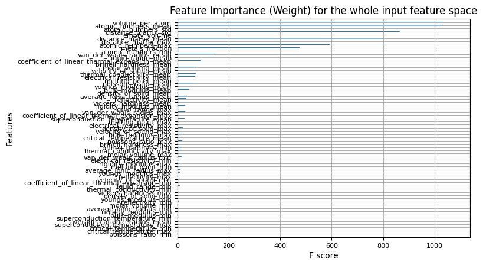
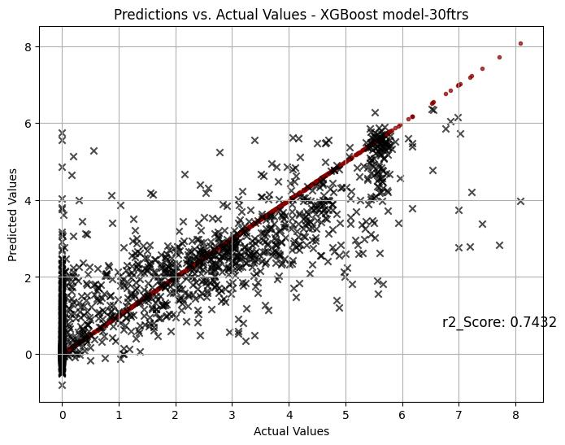
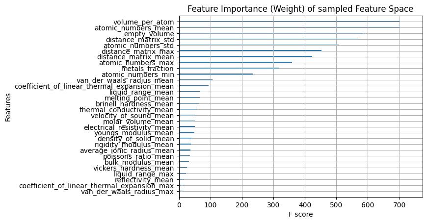

# Machine Learning-Driven Prediction of Bandgap in Semiconductor Materials Using Feature Engineering and Optimization

## Machine learning in Semiconductor

### Abstract

In this study, we demonstrated the application of machine learning (ML) to predict important properties of inorganic semiconductor materials (we will be using Si and Ge in our case), with particular focus on the energy bandgap, based on their composition, structure, and individual unique properties. Historically, experimental methods for determining semiconductor properties were resource-intensive and time-consuming; the use of alternative approaches like ML to expedite the discovery and optimization of materials for electronic applications has contributed to a massive time reduction and cost-effectiveness. In this thesis, we harnessed extensive material databases such as the MaterialsProject database and advanced ML techniques, such as Extreme Gradient Boosted Trees (XGBoost), to aim to develop robust predictive models. This study highlights feature engineering, dataset preprocessing, model optimization (using the Hyper-Parameter Optimization (HPO), which we demonstrated using the 'Optuna' Python library to enhance predictive accuracy), and demonstrating that a reduction in feature space of over 70% can be achieved without compromising model performance. This analysis has significant implications for the field of materials science, offering some insights on the possibility of having a cost-effective and less-time-consuming electronic device manufacturing.

## 1. Introduction

### 1.1 Machine Learning in Materials Science

Machine learning has emerged as a powerful tool in materials science, enabling researchers to analyze large datasets and uncover patterns that are not easily discernible through traditional methods. ML has been successfully applied in various domains of materials science, including the discovery of new materials, property prediction, and process optimization. The use of ML for predicting semiconductor properties is a growing area of interest, driven by the availability of large material databases and advances in computational techniques.

- **Material Property Prediction** : ML models can predict key properties like bandgap, carrier mobility, and thermal conductivity based on the material’s composition and structure. This allows researchers to screen a large number of materials quickly without extensive experiments.

- **Discovery of New Materials**: By analyzing existing datasets, ML algorithms can identify patterns and suggest new semiconductor materials that might have desirable properties, such as higher efficiency or better thermal stability.

- **Process Optimization**: In semiconductor manufacturing, ML is used to optimize processes like deposition, doping, and lithography.

- **Defect Detection**: ML algorithms can be employed in real-time defect detection in semiconductor wafers during the manufacturing process, reducing wastage and ensuring higher quality products.

### 1.2 Objectives

The primary objective of this research is to develop a machine learning soltuion capable of predicting the energy bandgap of semiconductor materials based on their structural and compositional features. The specific goals include:

- Identifying key features that can predict the energy bandgap of semiconductors.

- Constructing a comprehensive dataset using descriptors that characterize semiconductor materials.

- Building and training a predictive model using Extreme Gradient Boosted Trees (XGBoost).

- Evaluating the impact of feature reduction on model performance.

- Providing insights into improving prediction accuracy.

## 2. Literature Review

### 2.1 Semiconductor Materials and Their Importance

Semiconductors are materials that have electrical conductivity between that of a conductor (like copper) and an insulator (like glass). They are the foundation of modern electronics, used in devices like transistors, diodes, and integrated circuits. The unique electrical properties of semiconductors, which lie between conductors and insulators, are largely determined by their energy bandgap. The ability to accurately predict the bandgap of a material is crucial for designing devices with specific electrical characteristics.

Integration of ML into semiconductor research and production represents a significant advancement. By exploring ML algorithms, especially applying the concept to determining the bandgap, the semiconductor industry can reduce development time, improve material performance, and streamline manufacturing processes, ultimately leading to more efficient and cost-effective electronic devices.

### 2.2 Feature Engineering in Machine Learning

Feature engineering is a critical step in building ML models, involving the selection and transformation of variables to enhance model performance. In materials science, features are derived from the material's composition, structure, and other physical properties. Effective feature engineering can significantly improve the predictive accuracy of ML models by capturing the underlying relationships between input features and the target property.

## 3. Methodology

### 3.1 Identifying the main features Relevant to predict the energy bandgap of semiconductors.

A major challenge and objectives in material science is to generate machine learning (ML) models that can accurately, and rapidly predict a property for a given material by using information derived from the material's structure. However, when the right decriptors are available, predicting material properties such as the energy bandgap would take only few seconds or minimal time using an ML Model, instead of consuming several hours, days or even months to perform. To acheive such an objective, one must find features that can map a material structure in unique material properties. The feature descriptors must be unique to each material and feasible to calculate. An ML model can subsequently be trained to translate descriptors into properties i.e perform the mapping of structure against property. _No matter how sophisticated or "deep" the ML models are, they will fail as long as the descriptors are poorly choose_
The quality of descriptors is usually by the ability of the descriptors to train predictive ML models.
<https://www.google.com/url?q=https%3A%2F%2Fscholar.google.com%2Fcitations%3Fuser%3DNhT7vZIAAAAJ>

These criteria are important when considering descriptors.

- Meaningfulness of features
- calculation efficiency
- Number of descriptors within the features
- Elemental features
- Geometry-based features
- Electronic structure features
- Ab initio-based features

In our approach to determining the descriptors, we considered All the features listed above giving special references to the combination of the Geometry-based features and the Electronic structure features of that material. The predictions of those properties were then gotten using computational methods such as density functional theory (DFT), and in our case machine learning models. <https://github.com/sheriftawfikabbas/crystalfeatures/blob/master/descriptors_geometry.py>

### 3.2 Building the dataset based on descriptors

Clearly, Computative predictions using machine learning requires data in order to build their dataset. These dataset should contain all the features/properties that describes the materials. These data are usually obtained from open source database such as:

- AFLOW
- MaterialsProject(MP)

In our case we will be using the MaterialsProject(MP) for obtaining our dataset.

#### 3.2.1 The MaterialsProject database

The MaterialsProject (MP) database is a massive amount of material science data that was generated using density functional theory (DFT). Have a look at the database here: <https://materialsproject.org.> Check the statistics at the bottom of the page. There are more than 154,718 inorganic crystals in the database, along with the DFT-calculated properties of these materials. There are also 530,000 nanoporous materials, as well as other stuff. It's indeed a huge amount of material data.

For Example, here is the crystal structure of a compound Rh₂O₃ from the MaterialsProject database.


_fig 1: It is worth noting that every thing you see on the MP page for Rh₂O₃ was calculated using DFT._

#### 3.2.2 Using The MaterialsProject database to obtaining our the semiconductor descriptors.

We will be analysing two of the most common semiconductor element and their generates. The semiconductor elements are Si and Ge.


_fig 2: The silicon and Germanium atom_

Below are steps using The MaterialsProject database

- Install the package

  ```python
  pip install mp-api
  ```

- Import the library

  ```python
  from mp_api.client import MPRester
  import requests
  import logging
  import pandas as pd
  import numpy as np

  # Set logging level to ERROR to suppress INFO logs including the loading bar
  logging.getLogger("mp_api").setLevel(logging.ERROR)
  ```

- Accessing the database usings its API and obtaining the descriptors

  Here is the features we obtained using the API

  ```python
  with MPRester("API_KEY") as mpr:
  docs = mpr.summary.search(elements=["Ge"], fields=["material_id", "band_gap","formula_pretty"])
  mpids = [doc.material_id for doc in docs]

  def descriptors(cif):

      atomic_numbers = []

      distance_matrix = []
      van_der_waals_radius = []
      electrical_resistivity = []
      velocity_of_sound = []
      reflectivity = []
      poissons_ratio = []
      molar_volume = []
      thermal_conductivity = []
      melting_point = []
      critical_temperature = []
      superconduction_temperature = []
      liquid_range = []
      bulk_modulus = []
      youngs_modulus = []
      brinell_hardness = []
      rigidity_modulus = []
      vickers_hardness = []
      density_of_solid = []
      coefficient_of_linear_thermal_expansion = []
      average_ionic_radius = []
      average_cationic_radius = []
      average_anionic_radius = []


      full_structure = mpr.get_structure_by_material_id(cif.material_id)

      structure = full_structure[0]

      numElements = len(full_structure.atomic_numbers)

      num_metals = 0
      for e in structure.species:
          if e.Z in range(3, 4+1) or e.Z in range(11, 12+1) or e.Z in range(19, 30+1) or e.Z in range(37, 48+1) or e.Z in range(55, 80 + 1) or e.Z in range(87, 112+1):
              num_metals += 1
      metals_fraction = num_metals/numElements

      spg = full_structure.get_space_group_info()

      spacegroup_numbers = {}
      for i in range(1, 231):
          spacegroup_numbers[i] = 0

      spacegroup_numbers[spg[1]] = 1

      spacegroup_numbers_list = []
      for i in range(1, 231):
          spacegroup_numbers_list += [spacegroup_numbers[i]]

      atomic_numbers = [np.mean(full_structure.atomic_numbers), np.max(full_structure.atomic_numbers), np.min(
          full_structure.atomic_numbers), np.std(full_structure.atomic_numbers)]

      # Lattice parameters:
      a_parameters = structure.lattice.abc[0]
      b_parameters = structure.lattice.abc[1]
      c_parameters = structure.lattice.abc[2]
      alpha_parameters = structure.lattice.angles[0]
      beta_parameters = structure.lattice.angles[1]
      gamma_parameters = structure.lattice.angles[2]

      distance_matrix += [np.mean(full_structure.distance_matrix), np.max(full_structure.distance_matrix),
                          np.min(full_structure.distance_matrix), np.std(full_structure.distance_matrix)]

      e1, e2, e3, e4, e5, e6, e7, e8, e9, e10, e11, e12, e13, e14, e15, e16, e17, e18, e19, e20, e21, e22, e23 = [
      ], [], [], [], [], [], [], [], [], [], [], [], [], [], [], [], [], [], [], [], [], [], []
      for e in structure.species:
          e1 += [e.van_der_waals_radius]
          e2 += [e.electrical_resistivity]
          e3 += [e.velocity_of_sound]
          e4 += [e.reflectivity]
          e6 += [e.poissons_ratio]
          e7 += [e.molar_volume]
          e8 += [e.thermal_conductivity]
          e9 += [e.melting_point]
          e10 += [e.critical_temperature]
          e11 += [e.superconduction_temperature]
          e12 += [e.liquid_range]
          e13 += [e.bulk_modulus]
          e14 += [e.youngs_modulus]
          e15 += [e.brinell_hardness]
          e16 += [e.rigidity_modulus]
          # e17 +=[e.mineral_hardness ]
          e18 += [e.vickers_hardness]
          e19 += [e.density_of_solid]
          e20 += [e.coefficient_of_linear_thermal_expansion]
          e21 += [e.average_ionic_radius]
          e22 += [e.average_cationic_radius]
          e23 += [e.average_anionic_radius]

      e1 = [0 if v is None else v for v in e1]
      e2 = [0 if v is None else v for v in e2]
      e3 = [0 if v is None else v for v in e3]
      e4 = [0 if v is None else v for v in e4]
      # e5=[0 if v is None else v for v in e5]
      e6 = [0 if v is None else v for v in e6]
      e7 = [0 if v is None else v for v in e7]
      e8 = [0 if v is None else v for v in e8]
      e9 = [0 if v is None else v for v in e9]
      e10 = [0 if v is None else v for v in e10]
      e11 = [0 if v is None else v for v in e11]
      e12 = [0 if v is None else v for v in e12]
      e13 = [0 if v is None else v for v in e13]
      e14 = [0 if v is None else v for v in e14]
      e15 = [0 if v is None else v for v in e15]
      e16 = [0 if v is None else v for v in e16]
      # e17=[0 if v is None else v for v in e17]
      e18 = [0 if v is None else v for v in e18]
      e19 = [0 if v is None else v for v in e19]
      e20 = [0 if v is None else v for v in e20]
      e21 = [0 if v is None else v for v in e21]
      e22 = [0 if v is None else v for v in e22]
      e23 = [0 if v is None else v for v in e23]

      van_der_waals_radius = [np.mean(e1), np.max(e1), np.min(e1), np.std(e1)]
      electrical_resistivity = [np.mean(e2), np.max(e2), np.min(e2), np.std(e2)]
      velocity_of_sound = [np.mean(e3), np.max(e3), np.min(e3), np.std(e3)]
      reflectivity = [np.mean(e4), np.max(e4), np.min(e4), np.std(e4)]
      poissons_ratio = [np.mean(e6), np.max(e6), np.min(e6), np.std(e6)]
      molar_volume = [np.mean(e7), np.max(e7), np.min(e7), np.std(e7)]
      thermal_conductivity = [np.mean(e8), np.max(e8), np.min(e8), np.std(e8)]
      melting_point = [np.mean(e9), np.max(e9), np.min(e9), np.std(e9)]
      critical_temperature = [np.mean(e10), np.max(
          e10), np.min(e10), np.std(e10)]
      superconduction_temperature = [
          np.mean(e11), np.max(e11), np.min(e11), np.std(e11)]
      liquid_range = [np.mean(e12), np.max(e12), np.min(e12), np.std(e12)]
      bulk_modulus = [np.mean(e13), np.max(e13), np.min(e13), np.std(e13)]
      youngs_modulus = [np.mean(e14), np.max(e14), np.min(e14), np.std(e14)]
      brinell_hardness = [np.mean(e15), np.max(e15), np.min(e15), np.std(e15)]
      rigidity_modulus = [np.mean(e16), np.max(e16), np.min(e16), np.std(e16)]
      vickers_hardness = [np.mean(e18), np.max(e18), np.min(e18), np.std(e18)]
      density_of_solid = [np.mean(e19), np.max(e19), np.min(e19), np.std(e19)]
      coefficient_of_linear_thermal_expansion = [
          np.mean(e20), np.max(e20), np.min(e20), np.std(e20)]
      average_ionic_radius = [np.mean(e21), np.max(
          e21), np.min(e21), np.std(e21)]
      average_cationic_radius = [
          np.mean(e22), np.max(e22), np.min(e22), np.std(e22)]
      average_anionic_radius = [
          np.mean(e23), np.max(e23), np.min(e23), np.std(e23)]

      V = full_structure.volume

      volume_per_atom = V / numElements

      atom_volume = 0
      for e in structure.species:
          atom_volume += 4/3*np.pi*e.average_ionic_radius**3
      empty_volume = V - atom_volume

      descriptors_dict = {
          "atomic_numbers": atomic_numbers,
          "volume_per_atom": [volume_per_atom],
          "empty_volume": [empty_volume],
          "metals_fraction": [metals_fraction],
          "distance_matrix": distance_matrix,
          "van_der_waals_radius": van_der_waals_radius,
          "electrical_resistivity": electrical_resistivity,
          "velocity_of_sound": velocity_of_sound,
          "reflectivity": reflectivity,
          "poissons_ratio": poissons_ratio,
          "molar_volume": molar_volume,
          "thermal_conductivity": thermal_conductivity,
          "melting_point": melting_point,
          "critical_temperature": critical_temperature,
          "superconduction_temperature": superconduction_temperature,
          "liquid_range": liquid_range,
          "bulk_modulus": bulk_modulus,
          "youngs_modulus": youngs_modulus,
          "brinell_hardness": brinell_hardness,
          "rigidity_modulus": rigidity_modulus,
          "vickers_hardness": vickers_hardness,
          "density_of_solid": density_of_solid,
          "coefficient_of_linear_thermal_expansion": coefficient_of_linear_thermal_expansion,
          "average_ionic_radius": average_ionic_radius,
          "average_cationic_radius": average_cationic_radius,
          "average_anionic_radius": average_anionic_radius,
          "spacegroup_numbers": spacegroup_numbers_list
      }
      return descriptors_dict
  ```

  _This creates a list of element with their properties assessible._ _This Technical step above is called feature engineering we can see the rest of the code in the descriptors folder_

  Looping through Each of the structures to obtain the specific properties.

  ```python
  band_gaps = []
  formula = []

  for r in docs[]:
      bg = r.band_gap
      fl = r.formula_pretty

      full_structure = mpr.get_structure_by_material_id(r.material_id)
      structure = full_structure[0]

      output_df = pd.concat([output_df, pd.DataFrame(uneven_dict_converter(descriptors(r)))], ignore_index=True)

      band_gaps += [bg]
      formula += [fl]
  ```

  Here is what the dataset looks like

  #### output

  
  _fig 3: The raw dataset extracted from materials project. The dataset can be found in the data folder._

### 3.3 Building a model using an Extreme gradient Boosted tree (Xgboost) for the prediction of Semiconductor-Energy-Bandgap

Before building on the dataset, it is essential to clean up the dataset. The goal of data cleaning is to improve the quality of the data to ensure its accuracy, consistency, and reliability for analysis. You can find the steps in _src -> data-preprocessing folder_. However here are some important aspect of the preprocessing.

- #### importing libraries

```python
import pandas as pd
import warnings
import ast
import optuna

warnings.filterwarnings('ignore')
```

- #### Load data

```python
si_data = pd.read_csv('../data/SiliconProjectBandgap_dataset.csv')
ge_data = pd.read_csv('../data/GermaniumProjectBandgap_dataset.csv')
```

- #### Separating listed sample in the column to individual column

In our original dataset, we had a column 'atomic_number' whose values as a list are gotten from the concatenation of the _'mean' , 'std' , 'max' , 'min_ the following block of code splits the data into different columns.

```python
def expand_df(df, cols_to_expand):
    expanded_dfs = []

    suffixes = ['mean', 'max', 'min', 'std']

    for column in cols_to_expand:

        expanded_df = pd.DataFrame(df[column].tolist())

        num_columns = expanded_df.shape[1]

        if num_columns == 4:
            expanded_df.columns = [f'{column}_{suffix}' for suffix in suffixes]
        elif num_columns == 1:
            expanded_df.columns = [column]
        else:
            expanded_df.columns = [f'{column}_{i+1}' for i in range(num_columns)]

        expanded_dfs.append(expanded_df)

    # Concatenate the original dataframe with all the expanded columns
    expanded_df_final = pd.concat([df.drop(columns=cols_to_expand)] + expanded_dfs, axis=1)

    return expanded_df_final
```

_using the function_

```python
silicon = expand_df(sample_si, sample_si.columns)
germanium = expand_df(sample_ge, sample_ge.columns)
```

### 3.4 Hyper-Parameter Optimization

Hyper-Parameter Optimization (HPO) is the process of finding the best set of hyperparameters for a machine learning model to maximize its performance. In our case we used the python library "_Optuna [Tree Structured Parzen Estimator (TPE) ]_". The implementation is given below.

```python
def objective(trial, X, y):

    param = {
                "n_estimators" : trial.suggest_int('n_estimators', 0, 500),
                'max_depth':trial.suggest_int('max_depth', 3, 5),
                'reg_alpha':trial.suggest_uniform('reg_alpha',0,6),
                'reg_lambda':trial.suggest_uniform('reg_lambda',0,2),
                'min_child_weight':trial.suggest_int('min_child_weight',0,5),
                'gamma':trial.suggest_uniform('gamma', 0, 4),
                'learning_rate':trial.suggest_loguniform('learning_rate',0.05,0.5),
                'colsample_bytree':trial.suggest_uniform('colsample_bytree',0.4,0.9),
                'subsample':trial.suggest_uniform('subsample',0.4,0.9)
            }

    cv = KFold(n_splits=5, shuffle=True, random_state=0)

    cv_scores = np.empty(5)
    for idx, (train_idx, test_idx) in enumerate(cv.split(X, y)):
        X_train, X_test = X.iloc[train_idx], X.iloc[test_idx]
        y_train, y_test = y.iloc[train_idx], y.iloc[test_idx]

        model = XGBRegressor(**param)
        model.fit(
            X_train,
            y_train,
            eval_set=[(X_test, y_test)],
            eval_metric="mae",
            early_stopping_rounds=100)
        preds = model.predict(X_test)
        cv_scores[idx] = mean_absolute_error(y_test, preds)

    return np.mean(cv_scores)
```

The end results of the cleaned dataset is provided in the _data -> cleaned folder._

### 3.5 Building the model

We will be using an Extreme gradient Boosted tree (XGBoost), the reason being that XGBoost is based on gradient boosting, which builds models iteratively, combining weak learners (usually decision trees) into a strong predictive model. This approach allows XGBoost to capture complex patterns in the data that might be missed by simpler models. It also automatically ranks the importance of features, which is crucial in bandgap prediction where certain material properties might have a stronger influence. XGBoost can handle various data types, making it versatile for different datasets encountered in materials science.

#### 3.4.1 Model Development

##### a. Importing the required libraries

Each library has its specific functionality

```python
import pandas as pd
from xgboost import XGBRegressor
from sklearn.model_selection import train_test_split
import optuna
from sklearn.model_selection import KFold
from sklearn.metrics import mean_squared_error, mean_absolute_error
import numpy as np
import joblib
import matplotlib.pyplot as plt
import xgboost as xgb
from sklearn.metrics import r2_score
from tqdm.auto import tqdm


import warnings
warnings.filterwarnings('ignore')
```

##### b. Data Splitting

Here we split our data into _training_set_ and _test_set_ dataset

```python
X_train, X_test, y_train, y_test = train_test_split(si_data, si_bandgap, test_size=0.33, random_state=42)
```

```python
X = X_train
y = y_train
```

```python
X.reset_index(drop=True, inplace=True)
y.reset_index(drop=True, inplace=True)
```

##### c. Building and Training the model

```python
model = XGBRegressor(**study.best_params)

model.fit(X,y)
```

##### d. Model Evaluation

```python
X_test.reset_index(drop=True, inplace=True)
y_test.reset_index(drop=True, inplace=True)

predictions = model.predict(X_test)
```

```python
print(f"RMSE value = {(mean_squared_error(y_test,predictions))**0.5}")
```

#### output

```bash
RMSE value = 0.9762977926675184
```

_Analysing the R_2_

```python
r2 = r2_score(y_test, predictions)
print(r2)
```

#### output

```bash
0.7525909058536742
```

its visualisation is given as

```python
# Function to make prediction vs actual plots

def plot_predictions_vs_actual(y_true, y_pred, score_value, model_name=None, figsize=(8, 6),
                               title="Predictions vs. Actual Values",
                               xlabel="Actual Values", ylabel="Predicted Values",
                               cmap="viridis", alpha=0.7):
    """
    Plots a scatter plot of predictions vs. actual values, including an evaluation score annotation.

    Args:
        y_true (array-like): True target values.
        y_pred (array-like): Predicted values.
        score_value (float): Evaluation score to display on the plot.
        model_name (str, optional): Name of the model to include in the title.
        figsize (tuple, optional): Figure size. Defaults to (8, 6).
        title (str, optional): Plot title. Defaults to "Predictions vs. Actual Values".
        xlabel (str, optional): X-axis label. Defaults to "Actual Values".
        ylabel (str, optional): Y-axis label. Defaults to "Predicted Values".
        alpha (float, optional): Transparency of scatter points. Defaults to 0.7.
    """

    plt.figure(figsize=figsize)
    plt.scatter(y_true, y_true, color='darkred', alpha=alpha, label='True Values', marker='.')
    plt.scatter(y_true, y_pred, color='k', alpha=alpha, label='Predicted Values',  marker='x')

    if model_name:
        plt.title(f"{title} - {model_name}")
    else:
        plt.title(title)

    plt.xlabel(xlabel)
    plt.ylabel(ylabel)

    plt.grid(True)

    # Annotate with evaluation score
    score_text = f"r2_Score: {score_value:.4f}"
    plt.annotate(score_text, xy=(0.8, 0.2), xycoords="axes fraction", fontsize=12, color="black")
```

```python
plot_predictions_vs_actual(y_test, model.predict(X_test), r2_score(y_test,model.predict(X_test)), model_name='XGBoost model-95ftrs')
plt.savefig("../assets/pred_plot_xgboost96ftrs.jpg", bbox_inches='tight')
```

#### output


_fig 4: Predictions vs. Actual Values with the 95 features of matrix._

### 3.5 Features of importance

In our feature engineering, we used as much descriptive features we could find to efficently map a material structure in its unique material properties. However, this would prompt us to use features that have little or no contribution to the determination of this dependent variable.

Using the XGBoost 'plot_importance' method, we can plot a chart to see the importance of each features ranked by their weights in building the resulting model. This is given below as:

```python
plt.figure(figsize=(10, 20))
ax = xgb.plot_importance(model, importance_type='weight', show_values=False, title='Feature Importance (Weight) for the whole input feature space')
ax.tick_params(axis='both', which='major', labelsize=8)

# saving the image
plt.savefig("../assets/feature_importance_95ftrs.jpg", bbox_inches='tight')
```

#### output


_fig 5: feature importance(weight) for the whole input feature space. it is clear that there are some features that have little or no contribution to the determination of the bandgap._

### 3.5.1 Showing that features reduction by 70% and selection of features importance for this project gave negligible effect on the prediction of the outcome (dependent variable)

By eliminating irrelevant or less important features, the model is less likely to overfit the training data. Overfitting happens when the model captures noise and details that are not relevant, leading to poor performance on unseen data. We will show that the reduction of the matrix of features by 70% retains its performance and efficiency. Using the code block below:

```python
feature_importances_ = model.get_booster().get_score(importance_type='weight')
feature_importance_df = pd.DataFrame(list(feature_importances_.items()), columns=['Feature', 'Importance'])

# Sort by importance (optional)
feature_importance_df = feature_importance_df.sort_values(by='Importance', ascending=False)

# taking the top 30 features ranked by feature importance
sample_features = feature_importance_df.iloc[:30,:]

X_sampled = X.loc[:,sample_features.Feature.values]
y_sampled = y.copy()

## Retraining on the sampled features:

study = optuna.create_study(direction="minimize", study_name="XGB regressor")
func = lambda trial: objective(trial, X_sampled, y_sampled)
study.optimize(func, n_trials=20, show_progress_bar=True)

model_sampled = XGBRegressor(**study.best_params)

model_sampled.fit(X_sampled,y_sampled)
```

predicting the test samples

```python
predictions_sampled = model_sampled.predict(X_test.loc[:,sample_features.Feature.values])

print(f"RMSE value = {(mean_squared_error(y_test,predictions_sampled))**0.5}")

##  r2 Score for the reduced feature space :
r2 = r2_score(y_test, predictions_sampled)
print(r2)
```

#### output

```bash
RMSE value = 0.9945795309846897
r2 = 0.7432
```

We can see its visualisation as follows:

```python
plot_predictions_vs_actual(y_test, predictions_sampled, r2_score(y_test,predictions_sampled), model_name='XGBoost model-30ftrs')
plt.savefig("../assets/pred_plot_xgboost_30ftrs.jpg", bbox_inches='tight')
```

#### output


_fig 6: Predictions vs. Actual Values with the 30 features of matrix.A reduction of up to 70% gives a similar prediction with only 1% loss (which can be negligible)._

The chart of the important feature is given below:


_fig 7: feature importance(weight) with 30 feature space. it is clear that there are some features that have little or no contribution to the determination of the bandgap. The chart showing 30 features of importance_

## 4. Results and Discussion

### 4.1 Model Performance

The XGBoost model demonstrated a high degree of accuracy in predicting the energy bandgap of semiconductor materials. The RMSE value was 0.976, and the R² score was 0.752, indicating that the model explained approximately 75% of the variance in the bandgap data. These results highlight the effectiveness of ML in capturing the complex relationships between material features and their electronic properties.

### 4.2 Feature Importance

Feature importance analysis revealed that certain descriptors had a significant impact on the model's predictions. Features such as atomic number, lattice parameters, and electronic structure parameters were among the top contributors. This information is valuable for guiding future research efforts, as it identifies the key factors influencing the bandgap.

### 4.3 Feature Reduction and Its Impact

A critical aspect of this research was to examine the impact of feature reduction on model performance. By reducing the feature space by 70% and retaining only the most important features, we observed a minimal decrease in model performance. The RMSE value for the reduced model was 0.995, and the R² score was 0.743, demonstrating that the reduced model maintained nearly the same predictive accuracy as the full model. This finding underscores the potential of feature reduction to simplify models without sacrificing accuracy, making them more interpretable and computationally efficient.

### 4.4 Implications for Semiconductor Research

The ability to predict semiconductor properties using ML has significant implications for the field of materials science. By providing a rapid and accurate method for assessing material properties, ML can accelerate the discovery of new materials with desirable characteristics, optimize manufacturing processes, and reduce the time and cost associated with traditional experimental methods. The insights gained from feature importance analysis can also guide the development of new materials with tailored properties, contributing to advancements in electronic device performance.

## 5. Conclusion

### 5.1 Summary of Findings

This project demonstrated the successful application of machine learning to predict the energy bandgap of semiconductor materials. By leveraging extensive material databases and advanced ML techniques, we developed a predictive model that achieved high accuracy while reducing the complexity of the feature space. The results highlight the potential of ML to transform the field of materials science, offering a powerful tool for discovering and optimizing semiconductor materials.

### 5.2 Future Work

Future research could explore the application of ML to predict other material properties, such as carrier mobility and thermal conductivity, further expanding the capabilities of ML in materials science. Additionally, incorporating more advanced ML techniques, such as deep learning, could enhance predictive accuracy and uncover deeper insights into the relationships between material features and properties. Collaborative efforts between experimentalists and ML researchers could also lead to the development of hybrid approaches that combine the strengths of both methods, offering a comprehensive solution for materials discovery and optimization.

### 5.3 Recommendations

To improve the predictive accuracy of ML models in semiconductor research, it is recommended to:

- Expand the dataset to include a wider range of materials and properties.
- Incorporate additional features that capture more aspects of the material's structure and composition.
- Explore advanced feature engineering techniques to identify new descriptors that may have a significant impact on material properties.
- Utilize ensemble learning methods to combine the strengths of different ML algorithms, potentially leading to more robust predictions.

## References

- Materials Project. (n.d.). Retrieved from <https://materialsproject.org.>
- Pedregosa, F., Varoquaux, G., Gramfort, A., Michel, V., Thirion, B., Grisel, O., ... & Duchesnay, E. (2011). Scikit-learn: Machine Learning in Python. Journal of Machine Learning Research, 12, 2825-2830.
- Chen, T., & Guestrin, C. (2016). XGBoost: A Scalable Tree Boosting System. In Proceedings of the 22nd ACM SIGKDD International Conference on Knowledge Discovery and Data Mining (pp. 785-794).
- Yamashita, R., Nishio, M., Do, R. K., & Togashi, K. (2018). Convolutional neural networks: an overview and application in radiology. Insights into Imaging, 9(4), 611-629.
- <https://www.google.com/url?q=https%3A%2F%2Fscholar.google.com%2Fcitations%3Fuser%3DNhT7vZIAAAAJ>
- <https://github.com/sheriftawfikabbas/crystalfeatures/blob/master/descriptors_geometry.py>
